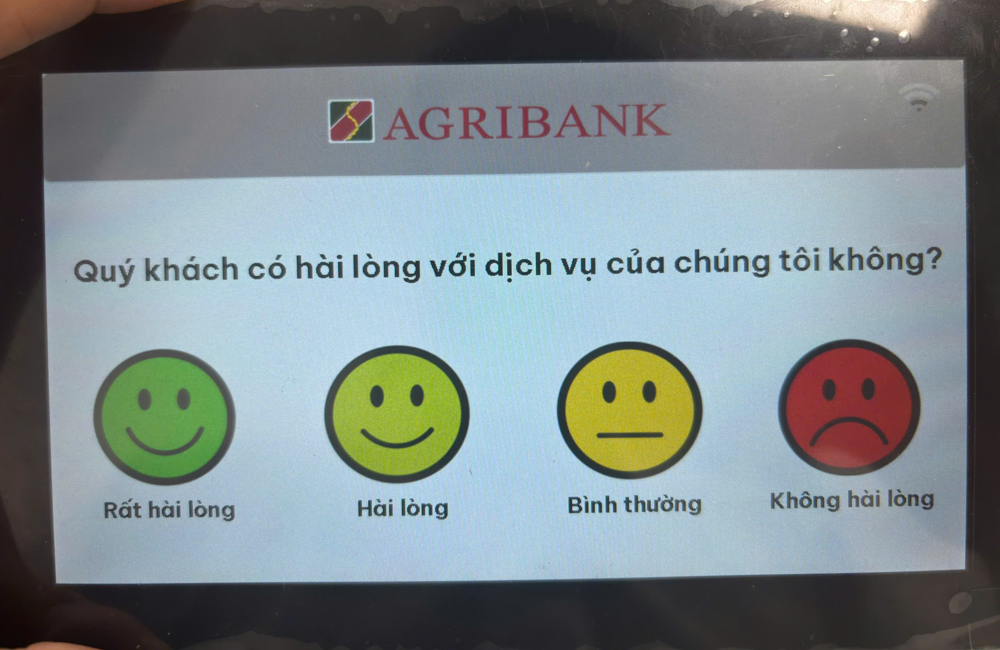
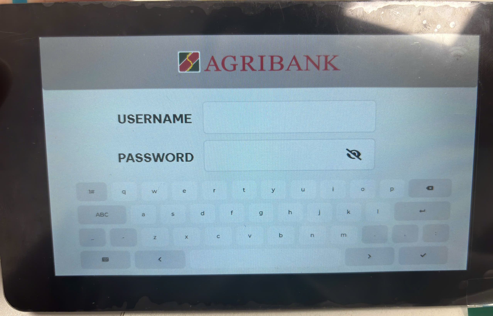
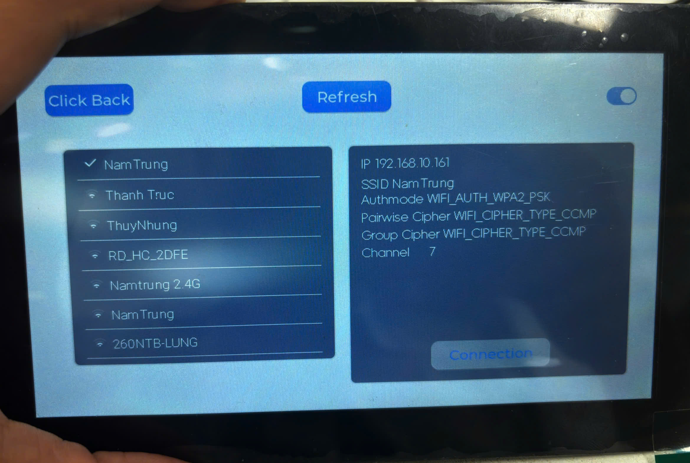

# Service Quality Rating Display

ESP32-S3 + 7 Inch LCD Touch Screen

Thiết bị màn hình đánh giá chất lượng dịch vụ sử dụng **ESP32-S3** và **LCD TFT 7 inch**,  
ứng dụng cho ngân hàng, bệnh viện, trung tâm hành chính, quầy giao dịch.

Khách hàng có thể đánh giá mức độ hài lòng sau khi hoàn thành giao dịch.  
Dữ liệu đánh giá được lưu cục bộ hoặc gửi về server để thống kê.

---

## Features

- Giao diện đánh giá trực quan trên LCD 7 inch
- Hỗ trợ cảm ứng
- Các mức đánh giá:
  - Rất hài lòng (tương đương điểm khi gửi đến server là 4)
  - Hài lòng (tương đương điểm khi gửi đến server là 3)
  - Bình thường (tương đương điểm khi gửi đến server là 2)
  - Không hài lòng (tương đương điểm khi gửi đến server là 1)
- Các giao diện của màn hình gồm có:
  - Giao diện đăng nhập dành cho nhân viên (Screen 7)
  - Giao diện menu các chức năng (Screen 4)
  - Giao diện đánh giá chất lượng dịch vụ (Screen 1)
  - Giao diện đăng nhập wifi (Wifi Screen)
  - Giao diện tùy chỉnh thời gian chờ (Screen 6)
  - Giao diện chọn bàn phím gọi số để kết nối đến (Screen 5)
  - Giao diện cảm ơn khách hàng sau khi đánh giá (Screen 2)

- Kết nối WiFi được nhập từ màn hình
- Wifi sau khi được kết nối thành công sẽ được lưu trong bộ nhớ NVS và tự động kết nối khi khởi động thiết bị
- Kết nối lại wifi 10 lần khi bị mất kết nối
- Hiển biểu tượng sóng wifi 5 mức độ trên giao diện đánh giá và đăng nhập để người dùng biết tình trạng kết nối wifi
- Gửi dữ liệu lên server qua MQTT
- Sau khi hoàn thành dịch vụ, nhân viên gọi số thứ tự của khách hàng mới mà khách hàng cũ vẫn chưa đánh giá thì thiết bị sẽ chờ 10 giây, trong khoảng 10 giây này nếu có khách hàng có đánh giá thì sẽ lưu đánh giá lại và gửi đến server. Thời gian chờ mặc định là 10s nhưng có thể tùy chỉnh được
- Đánh giá của khách hàng sẽ được gửi đến server sau 10 giây kể từ lần cuối đánh giá. Thời gian chờ mặc định là 10s nhưng có thể tùy chỉnh được
- Nếu có sự cố xảy ra dẫn đến không thể gửi đánh giá của khách hàng đến server được thì thiết bị sẽ lưu lại đánh giá trong bộ nhớ NVS. Số lượng đánh giá tối đa lưu là 10 đánh giá.
- Có thể tùy chọn kết nối đến đến bàn phím gọi số của quầy trong hệ thống xếp hàng để nhận các số thứ tự của khách hàng từ quầy đó
- Mỗi nhân viên sẽ được cấp cho 1 username và password dùng để đăng nhập và lưu thông tin nhân viên cho các lần gửi đánh giá đến server

---

## System Overview

- MCU: **ESP32-S3**
- Display: **LCD TFT 7 inch**
- Touch Panel: Capacitive
- Connectivity: WiFi
- Storage: Flash nội ESP32

Hệ thống được kết nối với server trung tâm để tổng hợp dữ liệu đánh giá.

---

## Project Structure

```
project/
├── main/
│ ├── esp_mqtt_client/
│ ├── keypad/
│ ├── lcd_i2c/
│ ├── led/
│ ├── mac_utils/
│ ├── mutex/
| ├── nvs_utils/
│ ├── state_machine/
│ └── wifi/
└── README.md
```

## System Workflow

### 1. Boot & Login

- Thiết bị khởi động.
- Kiểm tra trạng thái đăng nhập đã lưu:
  - Đã đăng nhập nhưng chưa logout → hiển thị **màn hình đánh giá (Screen1)**

<div align="center">
  
  <br>
  <em>Màn hình đánh giá</em>
</div>

- Chưa đăng nhập → hiển thị **màn hình đăng nhập (Screen7)**

<div align="center">
  
  <br>
  <em>Màn hình đăng nhập</em>
</div>

---

### 2. WiFi Configuration

- Ở màn hình đăng nhập:
  - Chạm **3 lần liên tục góc trên cùng bên trái** → vào giao diện WiFi (Wifi Screen)
- Giao diện WiFi:
  - `Refresh`: quét lại danh sách WiFi
  - `Back`: quay lại màn hình trước
  - `Switch`: bật / tắt WiFi
- Khi khởi động:
  - Tự động kết nối WiFi đã lưu trong NVS

<div align="center">
  
  <br>
  <em>Màn hình cấu hình wifi</em>
</div>

---

### 3. Service Rating

- Nhân viên đăng nhập thành công → hiển thị màn hình đánh giá
- Khách hàng chọn mức đánh giá:
  - Hiển thị màn hình **Chúng tôi vô cùng cảm ơn phản hồi của quý khách!** trong 1 giây
- Dữ liệu đánh giá:
  - Được gửi lên server sau **timeout** kể từ lần đánh giá cuối
  - Timeout mặc định: **10s** (có thể chỉnh ở Screen 6)

---

### 4. Data Sending & Backup

- Gửi dữ liệu lên server qua **MQTT**
- Dữ liệu gửi đi sẽ bao gồm: ID của nhân viên sử dụng, điểm đánh giá, địa chỉ MAC thiết bị và số thứ tự của khách hàng
- Nếu gửi thất bại:
  - Lưu tối đa **10 đánh giá** vào NVS
  - Gửi lại khi kết nối MQTT thành công
- Tự động reconnect MQTT khi mất kết nối

---

### 5. Queue Number Handling (Keypad)

- `current_number`: số thứ tự đang xử lý tại quầy
- `next_number`: số thứ tự mới nhận từ bàn phím gọi số

**Logic:**

- Khi nhận số mới đầu tiên:
  - Lưu vào `next_number`
  - Bắt đầu timeout (không reset)
- Trong thời gian timeout:
  - Nếu có số mới → ghi đè `next_number`
- Khi timeout kết thúc:
  - `current_number = next_number`
  - Xóa `next_number`
- `current_number` được gửi kèm:
  - ID nhân viên
  - Điểm đánh giá

---

### 6. Menu & Settings

- Ở màn hình đánh giá và màn hình đăng nhập:
  - Chạm **3 lần góc trên bên trái** → vào menu
- Các chức năng:
  - **LOG OUT**: đăng xuất nhân viên-> Screen 7
  - **TIMEOUT**:
    - Chỉnh thời gian chờ gửi đánh giá
    - Chỉnh thời gian cập nhật `current_number`
    - Giá trị mặc định: 10s, tối đa: 100s
  - **KEYPAD**:
    - Chọn bàn phím gọi số trong hệ thống-> Screen
    - Thiết bị được chọn hiển thị số màu đen

---

| Supported Targets | ESP32-S3 |
| ----------------- | -------- |

| Supported LCD Controller | ST7262 |
| ------------------------ | ------ |

| Supported TOUCH Controller | GT911 |
| -------------------------- | ----- |

## How to use the example

## ESP-IDF Required

### Hardware Required

- An Waveshare ESP32-S3-Touch-LCD-4.3 development board

### Hardware Connection

The connection between ESP Board and the LCD is as follows:

```

       ESP Board                           RGB  Panel

+-----------------------+ +-------------------+
| GND +--------------+GND |
| | | |
| 3V3 +--------------+VCC |
| | | |
| PCLK+--------------+PCLK |
| | | |
| DATA[15:0]+--------------+DATA[15:0] |
| | | |
| HSYNC+--------------+HSYNC |
| | | |
| VSYNC+--------------+VSYNC |
| | | |
| DE+--------------+DE |
| | | |
| BK_LIGHT+--------------+BLK |
ESP Board TOUCH
+-----------------------+ +-------------------+
| GND+--------------+GND |
| | | |
| 3V3+--------------+VCC |
| | | |
| GPIO8+--------------+SDA |
| | | |
| GPIO9+--------------+SCL |
| | | |
ESP Board LED
+-----------------------+ +-------------------+
| GND +--------------+GND |
| | | |
| 3V3 +--------------+VCC |
| | | |
| AD +--------------+LED |
+-----------------------+ | |
| | | |
IO EXTENSION.EXIO1+--------------+TP_RST |
| | | |
IO EXTENSION.EXIO2+--------------+DISP_EN |
 +-------------------+

```

- Demonstrates an LVGL slider to control LED brightness.

### Configure the Project

### Build and Flash

Run `idf.py set-target esp32s3` to select the target chip.

Run `idf.py -p PORT build flash monitor` to build, flash and monitor the project. A fancy animation will show up on the LCD as expected.

The first time you run `idf.py` for the example will cost extra time.

(To exit the serial monitor, type `Ctrl-]`.)

See the [Getting Started Guide](https://docs.espressif.com/projects/esp-idf/en/latest/get-started/index.html) for full steps to configure and use ESP-IDF to build projects.

## Troubleshooting

For any technical queries, please open an https://service.waveshare.com/. We will get back to you soon.

```

```
